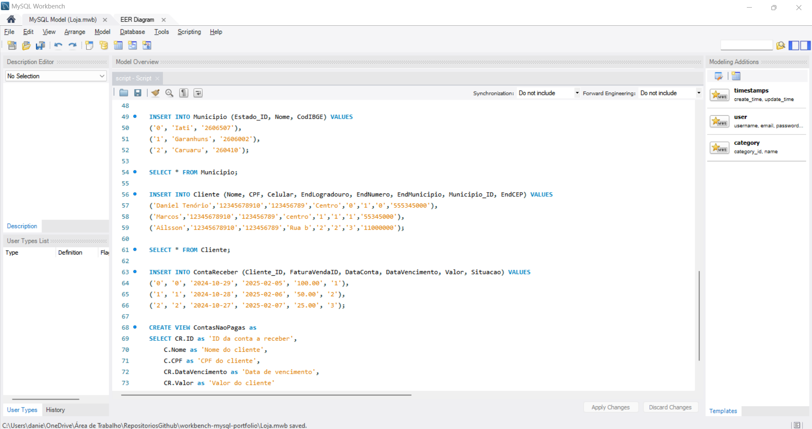

# Projeto portfolio spring web☕



> Projeto para criação de um banco de dados utilizando a linguagem SQL e realizar operações de manipulação e acesso aos dados

## Requisitos 💻

Antes de clonar o projeto e recomendado você ter os seguintes requisitos:

-   Necessario ter `MySQL Workbench` instalado
-   Requisito `git` para clonar
-   Sua maquina `Windows, Linux ou Mac`.
-   Conhecimento basico `SQL`

## Tecnologias 🚀

As principais tecnologias e ferramentas utilizadas neste projeto são:

-   `SQL`: é uma linguagem de programação que permite gerenciar, consultar e manipular dados em bancos de dados relacionais.

## Como instalar 🚀

Windows, Linux e macOS

```
git clone https://github.com/danielBRTanimacao/portfolio-workbench-mysql.git

cd portfolio-workbench-mysql
```

### Contato 📞

-   Nome: Daniel Tenório
-   Email: danieltenorio2046@gmail.com
-   LinkedIn: [Meu LinkedIn](https://www.linkedin.com/in/daniel-tenório-6471b0244/)
